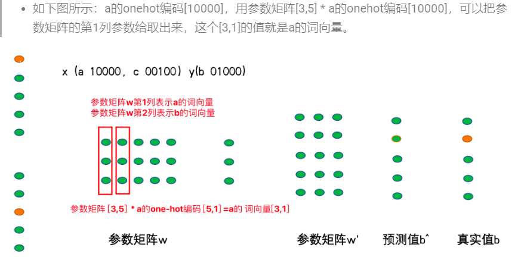

# 文本预处理-day02

## 1 文本张量的表示方法

文本张量表示

```properties
意义：将文本转换为向量（数字）的形式，使得模型能够识别进而实现训练，一般是进行词向量的表示
实现的方式：
one-hot
word2Vec
wordEmbedding
```

### 1.1 One-Hot 词向量表示

- 定义：

```properties
针对每一个词汇，都会用一个向量表示，向量的长度是n,n代表去重之后的词汇总量，而且向量中只有0和1两种数字
俗称：独热编码、01编码
```

- 代码实现

  ```python
  import jieba
  # 导入keras中的词汇映射器Tokenizer
  from tensorflow.keras.preprocessing.text import Tokenizer
  # 导入用于对象保存与加载的joblib
  from sklearn.externals import joblib
  
  # 思路分析 生成onehot
  # 1 准备语料 vocabs
  # 2 实例化词汇映射器Tokenizer, 使用映射器拟合现有文本数据 (内部生成 index_word word_index)
  # 2-1 注意idx序号-1
  # 3 查询单词idx 赋值 zero_list，生成onehot
  # 4 使用joblib工具保存映射器 joblib.dump()
  def dm_onehot_gen():
  
      # 1 准备语料 vocabs
      vocabs = {"周杰伦", "陈奕迅", "王力宏", "李宗盛", "吴亦凡", "鹿晗"}
  
      # 2 实例化词汇映射器Tokenizer, 使用映射器拟合现有文本数据 (内部生成 index_word word_index)
      # 2-1 注意idx序号-1
      mytokenizer = Tokenizer()
      mytokenizer.fit_on_texts(vocabs)
  
      # 3 查询单词idx 赋值 zero_list，生成onehot
      for vocab in vocabs:
          zero_list = [0] * len(vocabs)
          idx = mytokenizer.word_index[vocab] - 1
          zero_list[idx] = 1
          print(vocab, '的onehot编码是', zero_list)
  
      # 4 使用joblib工具保存映射器 joblib.dump()
      mypath = './mytokenizer'
      joblib.dump(mytokenizer, mypath)
      print('保存mytokenizer End')
  
      # 注意5-1 字典没有顺序 onehot编码没有顺序 []-有序 {}-无序 区别
      # 注意5-2 字典有的单词才有idx idx从1开始
      # 注意5-3 查询没有注册的词会有异常 eg: 狗蛋
      print(mytokenizer.word_index)
      print(mytokenizer.index_word)
  
  ```

  - One-Hot的使用

  ```python
  # 思路分析
  # 1 加载已保存的词汇映射器Tokenizer joblib.load(mypath)
  # 2 查询单词idx 赋值zero_list，生成onehot 以token为'李宗盛'
  # 3 token = "狗蛋" 会出现异常
  def dm_onehot_use():
  
      vocabs = {"周杰伦", "陈奕迅", "王力宏", "李宗盛", "吴亦凡", "鹿晗"}
  
      # 1 加载已保存的词汇映射器Tokenizer joblib.load(mypath)
      mypath = './mytokenizer'
      mytokenizer = joblib.load(mypath)
  
      # 2 编码token为"李宗盛"  查询单词idx 赋值 zero_list，生成onehot
      token = "李宗盛"
      zero_list = [0] * len(vocabs)
      idx = mytokenizer.word_index[token] - 1
      zero_list[idx] = 1
      print(token, '的onehot编码是', zero_list)
  
  ```

- One-Hot编码的缺点：

  - 割裂了词与词之间的联系（主要）
  - 如果n过大，会导致占用大量的内存（维度爆炸）

### 1.2 Word2Vec模型

```properties
word2vec是一种无监督的训练方法，本质是训练一个模型，将模型的参数矩阵当作所有词汇的词向量表示
两种训练方式：cbow、skipgram
```

#### 1.2.1 CBOW介绍

```properties
给一段文本，选择一定的窗口，然后利用上下文预测中间目标词
```

- 实现过程：


#### 1.2.2 word2vec之skipgram方式：

- 定义：给你一段文本，选定特定的窗口长度，然后利用中间词来预测上下文
- 实现过程：1、选定一个窗口长度：3、5、7等；2、指定词向量的维度：人为规定

  

- 获取词向量
- 

### 1.3 Fasttext实现word2vec的训练

- 基本过程：

  - 导包：fasttext
  - 获取数据集
  - 训练和保存
  - 加载使用

  ```python
  # 导入fasttext
  import fasttext
  
  def dm_fasttext_train_save_load():
      # 1 使用train_unsupervised(无监督训练方法) 训练词向量
      mymodel = fasttext.train_unsupervised('./data/fil9')
      print('训练词向量 ok')
  
      # 2 save_model()保存已经训练好词向量 
      # 注意，该行代码执行耗时很长 
      mymodel.save_model("./data/fil9.bin")
      print('保存词向量 ok')
  
      # 3 模型加载
      mymodel = fasttext.load_model('./data/fil9.bin')
      print('加载词向量 ok')
  
  
  # 步骤1运行效果如下：
  有效训练词汇量为124M, 共218316个单词
  Read 124M words
  Number of words:  218316
  Number of labels: 0
  Progress: 100.0% words/sec/thread:   53996 lr:  0.000000 loss:  0.734999 ETA:   0h 0m
  
  ```

### 1.4 WordEmbedding词向量

- 定义：将词映射到指定维度的空间：词向量的一种表示方法

- 实现过程

  ```python
  def dm02_nnembeding_show():
  
      # 1 对句子分词 word_list
      sentence1 = '传智教育是一家上市公司，旗下有黑马程序员品牌。我是在黑马这里学习人工智能'
      sentence2 = "我爱自然语言处理"
      sentences = [sentence1, sentence2]
  
      word_list = []
      for s in sentences:
          word_list.append(jieba.lcut(s))
      # print('word_list--->', word_list)
  
      # 2 对句子word2id求my_token_list，对句子文本数值化sentence2id
      mytokenizer = Tokenizer()
      mytokenizer.fit_on_texts(word_list)
      # print(mytokenizer.index_word, mytokenizer.word_index)
  
      # 打印my_token_list
      my_token_list = mytokenizer.index_word.values()
      print('my_token_list-->', my_token_list)
  
      # 打印文本数值化以后的句子
      sentence2id = mytokenizer.texts_to_sequences(word_list)
      print('sentence2id--->', sentence2id, len(sentence2id))
  
      # 3 创建nn.Embedding层
      embd = nn.Embedding(num_embeddings=len(my_token_list), embedding_dim=8)
      # print("embd--->", embd)
      # print('nn.Embedding层词向量矩阵-->', embd.weight.data, embd.weight.data.shape, type(embd.weight.data))
  
      # 4 创建SummaryWriter对象 词向量矩阵embd.weight.data 和 词向量单词列表my_token_list
      summarywriter = SummaryWriter()
      summarywriter.add_embedding(embd.weight.data, my_token_list)
      summarywriter.close()
  
      # 5 通过tensorboard观察词向量相似性
      # cd 程序的当前目录下执行下面的命令
      # 启动tensorboard服务 tensorboard --logdir=runs --host 0.0.0.0
      # 通过浏览器，查看词向量可视化效果 http://127.0.0.1:6006
  
      print('从nn.Embedding层中根据idx拿词向量')
      # # 6 从nn.Embedding层中根据idx拿词向量
      for idx in range(len(mytokenizer.index_word)):
          tmpvec = embd(torch.tensor(idx))
          print('%4s'%(mytokenizer.index_word[idx+1]), tmpvec.detach().numpy())
  ```

- 可视化：

  - 工具：tensorboard
  - 命令： tensorboard --logdir=runs --host 0.0.0.0


