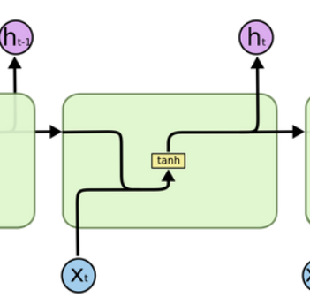
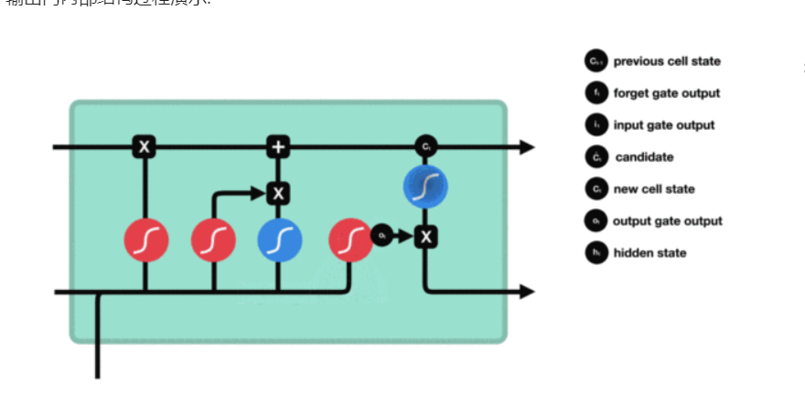

## RNN及其变体

### RNN模型

- 定义：
  - 循环神经网络：当前时间步的输出：当前时间步的输入+上一时间步的隐层输出
- 作用和应用场景：
  - 很好处理NLP各种任务：文本翻译、文本分类等等
- RNN模型的分类
  - 根据输入与输出结构
    - N vs N 
      - 特点：输入和输出是等长的
      - 范围：诗歌、对联
    - N vs 1
      - 特点：输入不限定长度，输出是唯一的
      - 范围：分类任务
    - 1 vs N
      - 特点：输入是唯一的，输出不限定长度
      - 范围：图片生成任务
    - N vs M（seq2seq架构）
      - 特点：输入和输出不等长
      - 范围：文本翻译任务等
  - 根据RNN内部结构
    - 传统RNN
    - LSTM
    - Bi-LSTM
    - GRU
    - Bi-GRU

### 传统RNN模型

- 内部结构

  

  - 多层num_layers理解：

  

  - 输入:

    - 当前时间步的输入xt
    - 上一时间步隐藏层的输出ht-1

  - 输出：

    - ht或则ot

  - RNN模型实现

    ```python
    import torch 
    import torch.nn as nn
    def dm_rnn_base():
        # input_size:代表输入张量x的维度(词向量维度)
        # hidden_size:代表隐藏层的神经元个数
        # num_layers:代表隐藏层的数量，默认是1
        rnn = nn.RNN(input_size=5, hidden_size=6, num_layers=1)
        # 改变隐层个数：
        # rnn = nn.RNN(input_size=5, hidden_size=6, num_layers=2)
        # input各参数含义：
            #第一个参数：sequence_length输入序列的长度(一个句子词汇或者字符的个数)
            #第二个参数：batch_size:批次样本数量
            #第三个参数：input_size:输入张量x的维度
        # input = torch.randn(1, 3, 5)
        #改变输入数据的长度
        "what time is it"
        input = torch.randn(4, 3, 5)
        # h0各参数的含义
            # 第一个参数：num_layers*num_directions(num_layers、num_directions（网格方向）一般默认为1，)
            # 第二个参数：batch_size:批次样本数量
            # 第三个参数：hidden_size:隐藏层的神经元个数
        #h0 = torch.randn(1, 3, 6)
        # 该变隐藏层个数
        h0 = torch.randn(1, 3, 6)
    
        # 一次性输入文本
        output, hn = rnn(input, h0)
        print(f'一次性输入文本的output---->形状{output.shape},数值：{output}')
        print(f'一次性输入文本的hn---->形状{hn.shape},数值：{hn}')
        ##一个词一个词的输入文本
        s_len = input.shape[0]
        for idx in range(s_len):
            tmp = input[idx].unsqueeze(0)
            # print(f'tmp---->{tmp.shape},{tmp}')
            # break
            output, h0 = rnn(tmp, h0)
            print(f'第{idx+1}次output--->：{output.shape}, {output}')
            print(f'第{idx+1}次ho--->：{h0.shape}, {h0}')
    
    ```

  - RNN的优缺点
    - 优点：计算机资源利用比较小，模型内部网络结构相对比较简单，处理短文本的时候，表现比较优异
    - 缺点：处理长文本的时候，容易造成梯度消失或梯度爆炸。

### LSTM模型

- 内部结构

  - 遗忘门

  - 输入门

  - 输出门

  - 细胞状态

  - 内部结构图

    

- BI-LSTM模型：

  - 双向LSTM, 本质内部网络结构没有发生改变，只是把模型应用了两次且方向不同，再把两次模型输出的结果进行拼接。

- LSTM模型代码实现

  ```python
  def dm_test_lstm():
      # 实例化lstm对象
      #第一个参数：input_size：输入数据的维度
      #第二个参数：hideen_size:隐藏层维度（神经元个数）
      # 第三个参数：num_layer,隐藏层层数
      lstm = nn.LSTM(5, 6, 1)
      # 第一个参数：sequence_length,句子长度
      # 第二个参数：batch_size,样本数量（批次）
      # 第三个参数：input_size:输入数据的维度
      input = torch.randn(8, 3, 5)
      # 第一个参数：num_layer*num_dire
      # 第二个参数：batch_size,样本数量
      # 第三个参数：hidden_size,隐藏层维度
      h0 = torch.randn(1, 3, 6)
      c0 = torch.randn(1, 3, 6)
  
      output, (hn, cn) = lstm(input, (h0, c0))
  
      print(f'output--->形状{output.shape},数据值{output}')
      print(f'hn--->形状{hn.shape},数据值{hn}')
      print(f'cn--->形状{cn.shape},数据值{cn}')
  ```

- LSTM的优缺点
  - 优点：长序列问题中，能够有效的缓解梯度消失或者梯度爆炸，相比传统RNN在长序列问题处理上表现较好。
  - 缺点：内部结构复杂，相同算力下，相比传统RNN计算效率低下。


